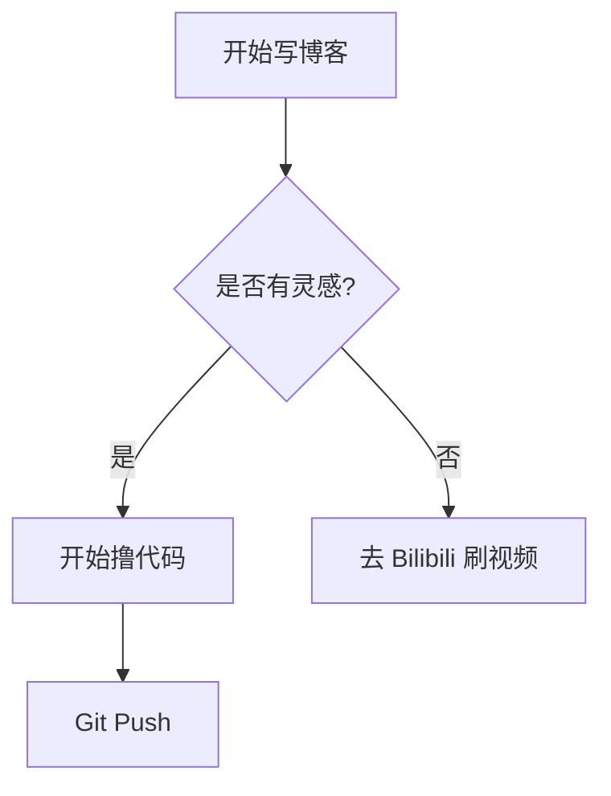
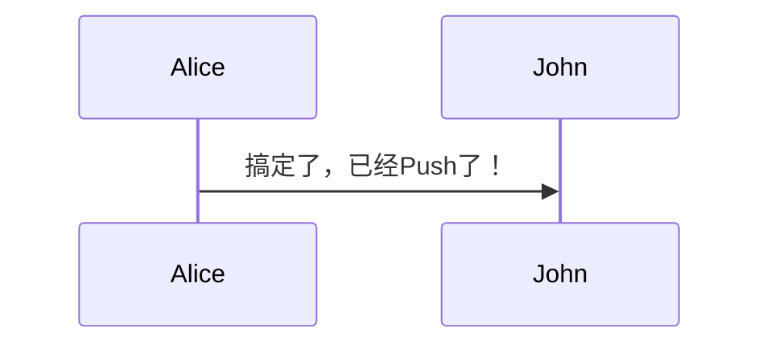

今天是五一放假的第二天，哦不，严格来说已经是第三天了，时间刚过零点。这篇blog主要还是为了测试我的网站配置，还有一些小细节留待睡醒再弄叭。

很好，经过一个下午的调试和配置，这个blog终于迈上正轨了。我打算稍后再添加我的头像和名字，我想既然是blog，再加上很少有人会访问，直接用自己真实的图片也行啊，哈哈哈以前没尝试过呢。blog网页的汉字也有问题，没有正确编码，还得再调整。随便放几个特殊格式的在下面，看看是否能正确渲染出来：

---

### 流程图

---

*   **语法要点**
    * `graph LR`：表示图片方向是从左到右，如果是`TD`则是从上到下。
    * `[]`：表示矩形框；`{}`：表示菱形框判断；`()`：表示圆角框。

### 序列图（Sequence Diagram）
非常适合展示对象交互：

---

### 数学公式
$\sum_{i=1}^{n} i = \frac{n(n+1)}{2}$

